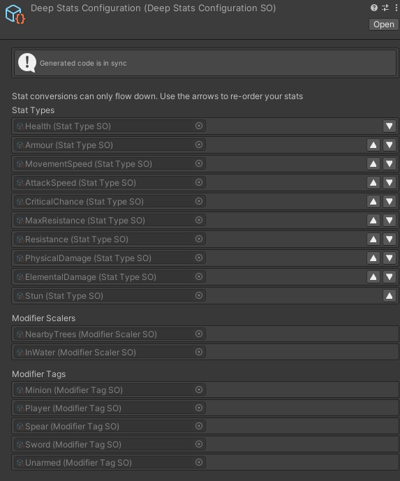

# StatConfiguration

The StatConfiguration asset is where you will configure the constants of your stat system.

You can create an instance of this scriptable object in your project with:\
Right Click -> Create -> DeepStats -> StatConfiguration

It is recommended to only have one of these assets in your project, as it will be used to generate the necessary code which the rest of DeepStats will depend on.

A StatConfiguration has the following properties:

### Stat Types
These are the Stat Types you'll be using in your project. If it's a numeric value you want to modify in your game, DeepStats is probably a good place for it.\
Some examples:
- Classic RPG stats: Maximum Health, Damage, Speed, Armour, Agility, Strength etc.
- If you're making a platformer and want the player to unlock double-jump, you could add a NumberOfJumps stat.
- If you're making a racing game and want to have speed boosts and oil slicks, you could add a Speed and Steering stat.

### Modifier Scalers
These are aspects of your gameplay that can be used to dynamically change a Modifier value.
Some examples:
- in a racing game, you may have a vehicleDamage scaler which will slow you down and reduce your steering

### Modifier Conditions
These are aspects of your gameplay that can be used to toggle a modifier on or off.
Some examples:
- in an ARPG, you may have a modifier where you do more damage to the target enemy if they are currently burning
- in an RTS, you may have a modifier where your units take less damage if they are inside a shield bubble

Once you have finished creating these, hit the 'Generate Code' button. A build will be triggered, and your enums should now be available for use in the editor and in code.